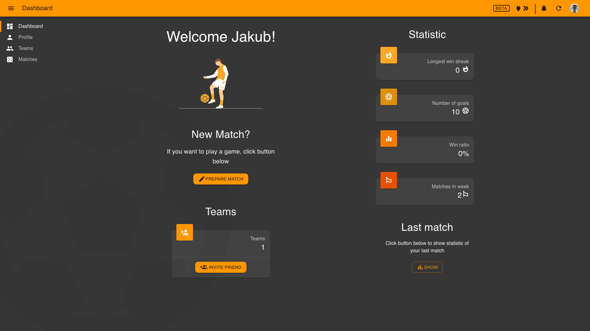
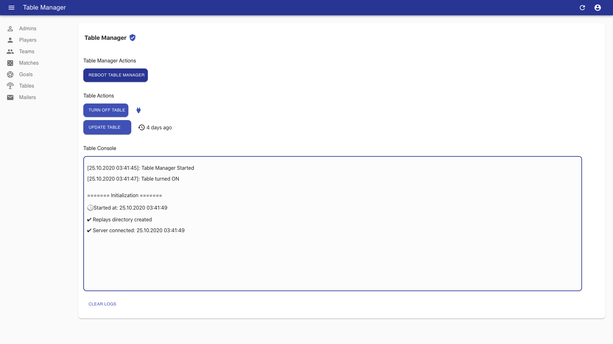

<div align="center">
  <a href="https://smart-table-football-admin.netlify.app">
    
  </a>
</div>

# [Smart Table Football](https://github.com/Jozwiaczek/smart-table-football)

> Plug&Play System for managing Smart Table Football with a lot of features.


## 🚩 Table of Contents

- [About](#-about)
- [Live Apps](#-live-apps)
- [Packages Docs](#-packages-docs)
- [Features](#-features)
- [Conventional Commits](#-conventional-commits)
- [Scripty](#-scripty)
- [Getting Started](#-getting-started)

## 📖 About

Smart Table Football is the whole system built for propose of managing and track games on physical table football.
With Raspberry Pi with few sensors it gives You ability to move game in a physical table football on the next level.

### Player Preview


<br/>

### Admin Preview



## 👀 Live Apps

| Module | Status                                                                                                                                                                          | Public URL                                     |
| ------ | ------------------------------------------------------------------------------------------------------------------------------------------------------------------------------- | ---------------------------------------------- |
| Admin  | [](https://app.netlify.com/sites/smart-table-football-admin/deploys) | https://smart-table-football-admin.netlify.app |
| Player | [](https://app.netlify.com/sites/smart-table-football/deploys)       | https://smart-table-football.netlify.app       |

## 📦 Packages Docs

- Backend:
  - [Api](./packages/api/README.md) - Server built on top of Feather.js, Socket.io with MongoDB which connects all modules.
  - [Core](./packages/core/README.md) - Package with all constants and models used in all others packages.
  - Raspberry:
    - [Table](./packages/table/README.md) - Main hardware server which manage every connected sensors like camera or gate sensor.
    - [Table Manager](./packages/table-manager/README.md) - This package contains manager for managing table server in run. It provides ability to remotely starts, stops and upgrade table server.
- Frontend:
  - [Admin](./packages/admin/README.md) - Administration app for managing all system resources like players, teams, matches and table server.
  - [Player](./packages/player/README.md) - Main app for players/users. It provides abilities for managing account, creating teams, matches and track all statistics from all games.
  - [UI Components](./packages/ui-components/README.md) - Package which contains all sharable UI components between [admin](../admin/README.md) and [player](../player/README.md) packages.

## 🎨 Features

- Plug and Play
- Mobile, Tablet and Desktop friendly
- App works offline, and it can be added to phone/desktop home screen
- Real-time connection with Raspberry PI
- Mailing system
- Internationalization (i18n)
- Themeable, Highly customizable interface
- Super-fast UI
- All kinds of statistics for players
- Goals replay (They can be also saved into provided Google Drive)

## 📏 Conventional Commits

Commitlint checks if your commit messages meet the [conventional commit](https://www.conventionalcommits.org/en/v1.0.0/) format.

Example:

```git
feat(api): add user service
```

Common types according to commitlint-config-conventional can be:
[conventional-commit-types](https://github.com/commitizen/conventional-commit-types/blob/master/index.json)

## 📝 Scripty

[Scirpty](https://github.com/testdouble/scripty) is the workspace level script's manager. It can run every executable file.
Every script which is same for every package like 'lint' should be declared in scripts directory.
After adding new script, it requires granting rights for read/write, to do that, in project root directory run:

```shell
yarn grant-scripty-permissions
```

## 🎓 Getting Started

1. Make sure you have all required tools:

   - [NodeJS](https://nodejs.org/)
   - [Yarn](https://yarnpkg.com/)
   - [Docker](https://www.docker.com/)

2. Add `.env` files with secrets based on `.env.example` in:

   - [Api](./packages/api)
   - [Table Manager](./packages/table-manager)
   - [Admin](./packages/admin)
   - [Player](./packages/player)

3. Deploy MongoDB Docker image

   - Go to [Api Docs](./packages/api/README.md)
   - Follow `How To Deploy And Manage MongoDB With Docker` section

4. Install project dependencies

   ```shell script
        yarn install
   ```

5. Run Api

   ```shell script
        cd packages/api
        yarn start
   ```

6. Prepare Raspberry and run Table Manager

   - Go to [Table Manager Docs](./packages/table-manager/README.md)
   - Follow `Getting Started` section

7. Run Player App

   ```shell script
       cd packages/player
       yarn start
   ```

8. Run Admin App

   ```shell script
       cd packages/admin
       yarn start
   ```

9. Play with UI Components

   ```shell script
       cd packages/ui-components
       yarn storybook
   ```

   For more details about this package check [ui-components README](./packages/api/README.md) in section `Getting started`.
